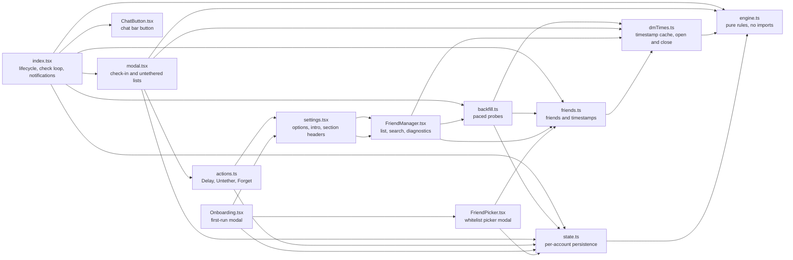
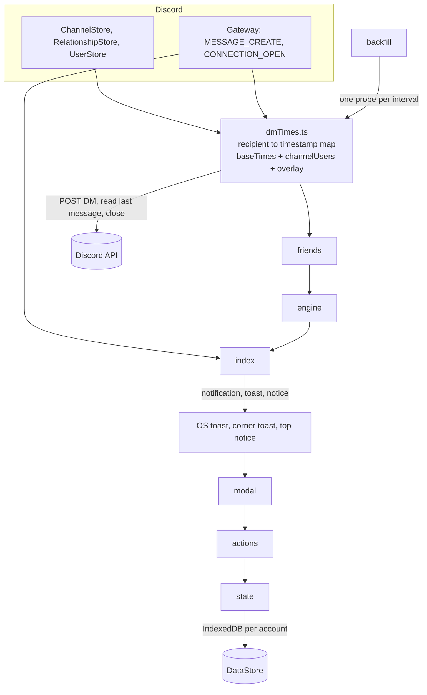
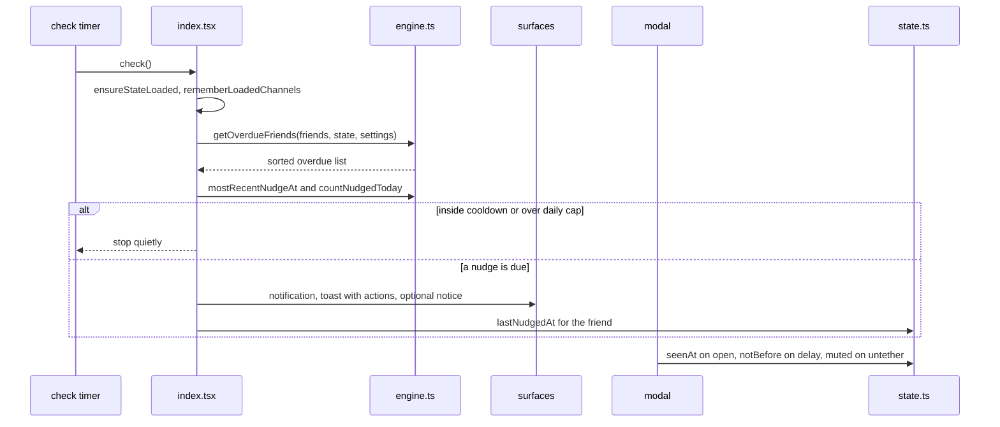
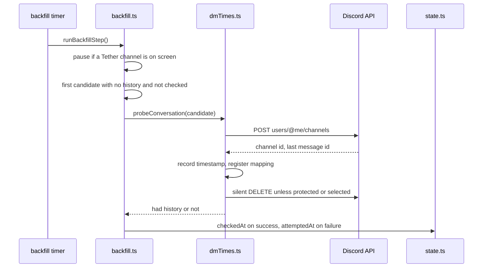

# Tether architecture

## Module map

Dependency rule: `engine.ts` imports nothing. Everything else may import it. No module imports `index.tsx`. `dmTimes.ts` never imports `state.ts`, which is what lets `state.ts` or `index.tsx` reset dmTimes caches without a cycle.

## Runtime data flow

## Check-in lifecycle

## Backfill lifecycle

## Storage keys

| Key | Scope | Contents |
| --- | --- | --- |
| `tether-state-<userId>` | per account | notBefore, muted, forgotten, tracked, lastNudgedAt, seenAt, checkedAt, attemptedAt |
| `tether-dm-times-v2-<userId>` | per account | remoteFetchedAt and known last message timestamps |
| `tether-onboarded-v5-<userId>` | per account | one-time onboarding flag |

## Runtime caches, not persisted

| Name | Where | Purpose |
| --- | --- | --- |
| `baseTimes` | dmTimes | timestamps from the DM list and observations |
| `channelUsers` | dmTimes | channel id to person id map |
| `protectedChannels` | dmTimes | channels opened through Tether, never closed by backfill |
